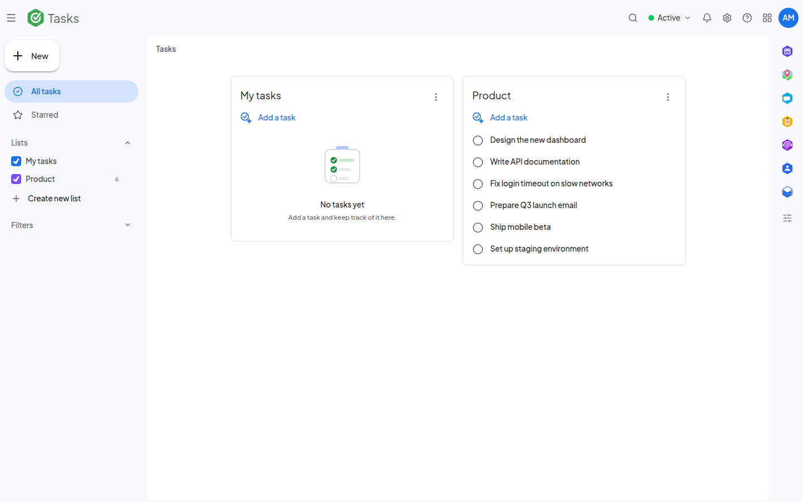

<!--
  SPDX-FileCopyrightText: 2026 Kubuno contributors
  SPDX-License-Identifier: AGPL-3.0-or-later
-->

<div align="center">


# Kubuno — Tasks

[](LICENSE)


**Tasks and Kanban boards for [Kubuno](https://github.com/kubuno/core) — the self-hosted, libre (AGPLv3) cloud platform, a sovereign alternative to Google Workspace and Microsoft 365.**

Keep your to-dos in side-by-side lists or on drag-and-drop boards, with subtasks, comments, labels, due dates, recurrence and CalDAV sync — all on your own server.

</div>

---

## Screenshots



<sub>Task lists and boards</sub>

## Features

- **Lists overview & Kanban boards** — the home view shows every list side by side, each in its own card with an "Add a task" row and a foldable "Completed" section; the same tasks can be worked as drag-and-drop stacks on a board. Subtasks, comments, labels, assignees, priorities, due dates and recurrence throughout; cards and rows are tinted with the task color for at-a-glance scanning.
- **In-place task composer** — "Add a task" opens an editor right where the task will live (title, details, quick "Today"/"Tomorrow" chips, full date-and-time picker, repeat control); it stays open so several tasks can be typed in a row, and a half-typed task is saved rather than lost.
- **Starred tasks** — star a task from its row or menu; the "Starred" view gathers the starred tasks of every list, split into "recently" and "over a month ago", each row showing which list it came from. Starring is independent of priority.
- **Smart collections** — Today, Upcoming, Overdue, Important, Completed… each collection is addressable by URL (`/tasks/#collection/today`), so direct links and the browser Back button both work.
- **Per-list controls** — reorder columns by dragging, drag a task between lists, and a per-list menu to sort (my order, date created, date, recently starred, title), rename, hide, print, delete completed, and clean up old tasks; the sort and folded state are remembered per person, so people sharing a list can each order it their own way.
- **Quick task creation from anywhere** — a globally mounted "New task" dialog is published as a platform service (`tasks.createTask`), so other modules (chat, notes…) can create a task without leaving their view. Consumers degrade gracefully when Tasks is not installed.
- **Cross-module task cards & labels** — "Copy for Kubuno" puts a rich JSON envelope on the clipboard; pasting it into another module renders an interactive task card that deep-links back to the task (`?task=<id>`). Tasks can also carry the platform-wide Kubuno labels alongside their board's own labels.
- **CalDAV & interop** — CalDAV synchronization (VTODO), per-task iCalendar (`.ics`) export, and calendar-overlay integration.
- **Delta sync for local-first clients** — `GET /boards/delta` and `GET /tasks/delta` stream owner-scoped changes past a monotonic cursor (live rows and tombstones, paginated), and create endpoints honor client-minted UUIDs, so offline clients can replay their local changes and pull server state incrementally.
- **Admin & per-user settings** — instance-wide policy (board sharing, board/task limits, completed-task retention, attachment size) from the core's admin console; display density, default view and grouping stored per user.
- **Your choice of database** — runs on PostgreSQL, MySQL/MariaDB or SQLite, picked by the administrator in configuration and read at start-up; SQLite needs no database server at all, which makes a single-machine or evaluation install trivial.

## Architecture

Kubuno is **modular**: a **core** (the platform's "operating system") plus independent **modules**. Each module — Tasks included — is a **separate process** that connects to the core at startup on its own dedicated port (**3116** for Tasks); the core proxies its routes (`/api/v1/tasks/*`), distributes events and serves its runtime-loaded React frontend bundle.

- **Backend** — `src/`: Axum + SQLx through the shared `kubuno-db` layer — PostgreSQL (schema `tasks`), MySQL/MariaDB or SQLite; migrations in `migrations/`.
- **Frontend** — `frontend/`: a React bundle built to `entry.js`, consuming `@kubuno/sdk`, `@ui` and `@kubuno/drive` from the host at runtime via its import map.

## Install

The easiest way to self-host a full Kubuno instance (core + every module, Tasks included) is the **all-in-one Docker image** (`ghcr.io/kubuno/kubuno`). See **[kubuno/docker](https://github.com/kubuno/docker)** for `docker compose` instructions.

To add this module to an existing instance, install its **Kubuno package** (`.kbpkg`) — the single format the core installs by itself, the same file on Linux, Windows and macOS. Grab it from the admin console's marketplace, or install it offline from the command line:

```bash
sudo kubuno modules:install dist/tasks-<version>-<os>-<arch>.kbpkg
sudo systemctl restart kubuno         # the core loads the module on (re)start
```

The `.kbpkg` is a ZIP archive rooted at the module folder; the core unpacks it in pure Rust, so installation is identical on every platform. It is the **only** distribution format for a module — a module is not a system service, so there are no `.deb`/`.rpm`/`.exe`/`.pkg` packages.

## Build & development

**Requirements:** Rust ≥ 1.82, Node.js ≥ 24, and PostgreSQL 16, MySQL/MariaDB or SQLite (no server needed).

```bash
cargo build --release                     # → target/release/kubuno-tasks (shared crates from git tags)
cd frontend && npm ci && npm run build    # → dist/{entry.js, entry.css} (@kubuno/* from npm)
bash build_kbpkg.sh                       # → dist/tasks-<version>-<os>-<arch>.kbpkg
bash build_kbpkg.sh --install             # build, install into the local module store, and restart
```

> Shared dependencies come from Kubuno — no `kubuno/core` checkout required:
> - **Rust** — shared crates via tagged git dependencies on `kubuno/core`.
> - **Frontend** — `@kubuno/sdk`, `@kubuno/ui` and `@kubuno/drive` from the `@kubuno` npm scope, resolved at runtime to the host's singletons through its import map.

## Configuration

Copy `config.toml.example` → `config.toml`, or use environment variables (`KUBUNO_CORE_URL`, `KUBUNO_INTERNAL_SECRET`, `KUBUNO_DB_*`). The database engine is the administrator's choice, set in `[database] engine` — `postgres` (default), `mysql`/`mariadb` or `sqlite` — and read at start-up: the same binary connects to whichever is named, and SQLite needs no server at all. Under the Kubuno supervisor the connection settings are injected by the core. See `module.toml` for the manifest (id, port, routes, sidebar entry, settings).

## Tech stack

Rust 2021 · Axum 0.7 · Tokio · SQLx 0.9 via `kubuno-db` (PostgreSQL, MySQL/MariaDB or SQLite; schema `tasks`) — React 19 · TypeScript · Vite · Tailwind CSS v4 · Zustand · React Query.

## Contributing

Contributions are welcome. Please open an issue to discuss any significant change before submitting a pull request.

## License

[AGPL-3.0-or-later](LICENSE) © Kubuno contributors.
